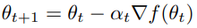
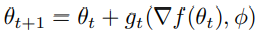

### Introduction to Meta-Learning
Machine learning tasks can be expressed as optimizing an objective function. Gradient descent serves as a standard approach for minimizing differentiable functions in a sequence of updates following the form: 

 

Vanilla gradient descent is intuitive, but only considers the use of gradients without accounting for second order information. Classical optimization techniques account for this by incorporating curvature information. Current research on optimization involves designing update rules that are optimized for certain subsets of problems. In the realm of deep learning AI, methods are specialized to handle high-dimensional, non-convex problems. Specialization to subclasses of problems is how performance can be improved. 

As described in [_Learning to Learn by Gradient Descent by Gradient Descent_](https://arxiv.org/pdf/1606.04474.pdf), the idea becomes to replace specific update rules by a learned update rule, called the optimizer g specified by its own parameters φ. The optimizee f becomes of the form:

 

The update rule g is modeled as a RNN (recurrent neural network) and dynamically updates with each iteration. 

The meta-learning idea has been brewing for a while, and recently has been recognized as an important building block in AI. The most general approach involves [Schmidhuber’s work](https://link.springer.com/article/10.1023/A:1007383707642) where the network and the learning algorithm are trained jointly by gradient descent. More complex cases involve reinforcement learning that [trains selection of step sizes](https://dl.acm.org/doi/10.5555/3016100.3016111) and [replacing the simple rule](https://ieeexplore.ieee.org/document/886220) with a neural network. Research has explored deeper into the possibilities of neural networks for meta-learning, evolving from [NNs with dynamic behavior](https://ieeexplore.ieee.org/document/750553) (without modifying network weights) to now allowing [backpropagation of a network](https://www.bioinf.jku.at/publications/older/3904.pdf) to feed into another NN, with both of them trained jointly. The approach in our highlighted paper modifies the network architecture to generalize the approach to larger NN optimization problems. 
