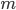
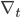

[Introduction]{.c9 .c5}

[Machine learning tasks can be expressed as optimizing an objective
function. Gradient descent serves as a standard approach for minimizing
differentiable functions in a sequence of updates following the form:
]{.c4}

[]{style="overflow: hidden; display: inline-block; margin: 0.00px 0.00px; border: 0.00px solid #000000; transform: rotate(0.00rad) translateZ(0px); -webkit-transform: rotate(0.00rad) translateZ(0px); width: 226.00px; height: 41.00px;"}

[Vanilla gradient descent is intuitive, but only considers the use of
gradients without accounting for second order information. Classical
optimization techniques account for this by incorporating curvature
information. Current research on optimization involves designing update
rules that are optimized for certain subsets of problems. In the realm
of deep learning AI, methods are specialized to handle high-dimensional,
non-convex problems. Specialization to subclasses of problems is how
performance can be improved. ]{.c4}

[]{.c4}

In [Learning to Learn by Gradient Descent by Gradient Descent]{.c8}[,
the idea becomes to replace specific update rules by a learned update
rule, called the optimizer g specified by its own parameters φ. The
optimizee f becomes of the form: ]{.c4}

[]{style="overflow: hidden; display: inline-block; margin: 0.00px 0.00px; border: 0.00px solid #000000; transform: rotate(0.00rad) translateZ(0px); -webkit-transform: rotate(0.00rad) translateZ(0px); width: 260.00px; height: 35.00px;"}

[The update rule g is modeled as a RNN (recurrent neural network) and
dynamically updates with each iteration. ]{.c4}

[]{.c4}

The meta-learning idea has been brewing for a while, and recently has
been recognized as an important building block in AI. The most general
approach involves
[[Schmidhuber](https://www.google.com/url?q=https://link.springer.com/article/10.1023/A:1007383707642&sa=D&ust=1587683510163000){.c1}]{.c0}'s
work where the network and the learning algorithm are trained jointly by
gradient descent. More complex cases involve reinforcement learning that
[[trains selection of step
sizes](https://www.google.com/url?q=https://dl.acm.org/doi/10.5555/3016100.3016111&sa=D&ust=1587683510163000){.c1}]{.c0} and
[[replacing the simple
rule](https://www.google.com/url?q=https://ieeexplore.ieee.org/document/886220&sa=D&ust=1587683510164000){.c1}]{.c0} with
a neural network. Research has explored deeper into the possibilities of
neural networks for meta-learning, evolving from [[NNs with dynamic
behavior](https://www.google.com/url?q=https://ieeexplore.ieee.org/document/750553&sa=D&ust=1587683510164000){.c1}]{.c0} (without
modifying network weights) to now allowing [[backpropagation of a
network](https://www.google.com/url?q=https://www.bioinf.jku.at/publications/older/3904.pdf&sa=D&ust=1587683510164000){.c1}]{.c0} to
feed into another NN, with both of them trained jointly. The approach in
our highlighted paper modifies the network architecture to generalize
the approach to larger NN optimization problems.

[]{.c4}

------------------------------------------------------------------------

[]{.c4}

THINGS ABOVE THIS LINE ARE IN README ALREADY (CONVERTED TO MARKDOWN)

[]{.c4}

[Gradient Descent]{.c9 .c5}

[]{.c9 .c5}

In elementary calculus classes, Euler's method is commonly presented as
a method of approximating values of an ordinary differentiable function
by discretely taking successive linear approximations at a certain
proportional step away from one another. The process goes like this. Say
you have some differentiable function  an initial
point  and a terminal point
 We can then define the step size to be
 for some positive integer
 We know what  is, and want
to approximate  Using  and
 we can find the linear approximation of
 With this approximation of
 we can then compute the linear approximation of
 in a similar fashion. Continuing to do this, we
are able to approximate the value of 

[Gradient descent works in a very similar way to the Euler's method via
successive step-wise linear approximations. In the case of gradient
descent, we commonly work with multivariate functions with the principle
purpose of obtaining the minimum of such functions, i.e. loss functions.
Furthermore, with this goal, gradient descent uses the negative gradient
of the function at each step, thereby ensuring that the approximations
continue to approach the minimum.]{.c4}

[The most basic gradient descent might utilize a constant step size. In
this case, gradient descent can be thought of as basically Euler's
method applied to multivariate functions and using the negative gradient
instead of the gradient. One might notice immediate issues with a
constant step size. For example, if the step size is large, then
initially, the approximations might approach the minimum quickly, saving
computational resources; however, once the approximations hit a critical
proximity to the minimum - where more precision might be needed to best
approximate the minimum - they might entirely skip over the minimum,
oscillating back and forth over the minimum and failing to achieve a
better approximate minimum. A step size that is small, on the other
hand, might have the exact opposite effect, being able to achieve a
better approximate minimum but requiring significantly more
computational time to reach it.]{.c4}

[Less basic gradient descent might adjust the step size by taking into
account second-order information as mentioned earlier. Furthermore,
quite advanced gradient descent techniques utilize hand-designed update
rules that might not even be strictly convex - making finding a minimum
difficult. It follows that we delve deeper into how we might learn such
update rules rather than hand-design them in order to achieve optimal
optimization.]{.c4}

[]{.c4}

[]{.c4}

[Fundamental Idea]{.c8 .c5}

[]{.c4}

As mentioned previously, the key goal is to learn an optimization
algorithm, or optimizer, for an objective function
 that expresses the problem at hand. To do this,
the optimizer is modeled as an RNN. Define to be
the final optimizee parameters, i.e. the parameters that are input into
 to (hopefully) minimize ,
where  are the optimizer parameters. The
optimizer is what updates the optimizee parameters at each time step -
 to - so it is natural
that the final optimizee parameters  be dependent
on how the optimizer has been updating the optimizee parameters
 along the way. This is, in turn, determined by
the parameters of the optimizer. Understanding this connection, we can
rethink the  to be a function of ; necessarily,
the final output of  will be determined by how
the optimizer has essentially plotted out the course for the optimizee
parameters to reach some  It is now that we can
formulate the loss function, given a distribution of functions
[, as a function of the optimizer
parameters:]{.c4}

We now take a look at how modeling the optimizer as an RNN allows the
dynamic adjustment of how the optimizee parameters are being updated.
Define  to be the update rule at time step
 i.e. the change between the optimizee parameters
at times  and  or
explicitly,  where  for
some end time  We can then have
 be the output of some RNN, which we will denote
as  with state  and
parameters  We note that the above loss function
depends only on the final output of the objective function given the
final optimizee parameters [ Since the loss
function is the primary way we determine how well the optimizer is
working, intuitively, such a definition doesn't provide much information
for the optimizer to train on. We thus might want to redefine the loss
function to potentially consider how the optimizer performs at each
step, i.e.]{.c4}

[It follows that]{.c4}

where  can be any
nonnegative real number, thought it is common for
 for all  Notice that
these loss functions equal one another if  for
 and  for all other
[Once again, if this is the case, then the
optimizer is only trained on the final step of the optimization, not
using any information regarding intermediate steps of the optimization;
this implies that the gradients of intermediate steps are zero, making
training the optimizer through methods, like Backpropagation Through
Time, inefficient.]{.c4}

As with many problems, we now want to minimize the loss function, and we
do so through gradient descent on  In order to
avoid computing second derivatives of  we make
the assumption that the gradient of the optimizee
 and the optimizer parameters
 are independent of one another, implying that
 Sampling a random function
 from the given distribution, we then compute the
gradient estimate [ using applying
backpropagation to the computational graph below. Notice that by our
assumption, we need only compute the solid edge gradients.]{.c4}

[]{style="overflow: hidden; display: inline-block; margin: 0.00px 0.00px; border: 0.00px solid #000000; transform: rotate(0.00rad) translateZ(0px); -webkit-transform: rotate(0.00rad) translateZ(0px); width: 624.00px; height: 228.00px;"}

[]{.c4}

[]{.c4}

[One problem that does arise from using the RNN model is that it
requires huge hidden states and an enormous set of parameters, in the
case where thousands of parameters are being optimized. In order to
circumvent this obstacle, a coordinatewise network architecture is used,
where the optimizer separates and operates on the individual coordinates
of the parameters. This allows for a smaller network, and the optimizer
can now be independent of the order of the parameters in the network.
Each coordinate is updated using a two-layer Long Short Term Memory
network which relies on previous hidden states and the optimizee
gradient for the coordinate. This idea is referred to as the LSTM
optimizer, as seen in the figure below, which shows a single step in the
LSTM optimizer and how there are separate LSTMs that share parameters
and have their own hidden states.]{.c4}

[]{.c4}

[]{style="overflow: hidden; display: inline-block; margin: 0.00px 0.00px; border: 0.00px solid #000000; transform: rotate(0.00rad) translateZ(0px); -webkit-transform: rotate(0.00rad) translateZ(0px); width: 520.50px; height: 286.11px;"}

[]{.c4}

[]{.c8 .c12}

[Examples and Experiments]{.c9 .c5}

[A variety of experiments are performed to test the effectiveness of the
learned optimizer in comparison to optimizers that were created by hand.
Each LSTM has 20 hidden units per layer and uses ADAM for minimization
of the loss function. ]{.c4}

[]{.c4}

[In the first experiment performed, the optimizer is trained on
synthetic 10-dimensional quadratic functions of the form ]{.c4}

[]{style="overflow: hidden; display: inline-block; margin: 0.00px 0.00px; border: 0.00px solid #000000; transform: rotate(0.00rad) translateZ(0px); -webkit-transform: rotate(0.00rad) translateZ(0px); width: 161.50px; height: 31.06px;"}

[where W is a 10x10 matrix and y is a 10-dimensional vector. Functions
are randomly generated for the optimizer to train on for 100 steps and
then tested on separately created functions from the same family. The
learning curves for several different optimizers are seen below, which
shows the average performance over several test functions over an
increasing number of steps. Since the LSTM has a steeper downward trend
that occurs faster than the trends for the other optimizers, this
suggests that use of the LSTM optimizer could be more effective than
other standard hand-crafted optimizers. ]{.c4}

[]{.c4}

[]{style="overflow: hidden; display: inline-block; margin: 0.00px 0.00px; border: 0.00px solid #000000; transform: rotate(0.00rad) translateZ(0px); -webkit-transform: rotate(0.00rad) translateZ(0px); width: 325.50px; height: 229.98px;"}

Another interesting application of this method is its possible use in
Neural art, which is when convolutional networks are used to transfer
artistic style. The complexity in neural art stems from how each style
and image input creates a unique and difficult optimization problem. The
problem is defined as
[]{style="overflow: hidden; display: inline-block; margin: 0.00px 0.00px; border: 0.00px solid #000000; transform: rotate(0.00rad) translateZ(0px); -webkit-transform: rotate(0.00rad) translateZ(0px); width: 331.50px; height: 25.50px;"}

where we have [c]{.c8} as the content image and [s]{.c8} as the style
image, and the minimizer of [f ]{.c8}[is the styled image. The last term
works as a regularizer in order to ensure smoothness of the styled
image, while the first two terms work for creating content and style
that match c and s. The optimizers were trained using only one style
image and 1800 64x64 content images from ImageNet, where 100 content
images were used for testing and 20 content images were used for
validation. ]{.c4}

[]{.c4}

[]{style="overflow: hidden; display: inline-block; margin: 0.00px 0.00px; border: 0.00px solid #000000; transform: rotate(0.00rad) translateZ(0px); -webkit-transform: rotate(0.00rad) translateZ(0px); width: 624.00px; height: 108.00px;"}

[]{.c4}

[The above images are example inputs and outputs, where the left image
in each group is the content image, the right is the style image, and
the center image is the one generated by the LSTM optimizer. ]{.c4}

[]{.c4}

[]{style="overflow: hidden; display: inline-block; margin: 0.00px 0.00px; border: 0.00px solid #000000; transform: rotate(0.00rad) translateZ(0px); -webkit-transform: rotate(0.00rad) translateZ(0px); width: 497.50px; height: 141.12px;"}

[]{.c4}

[The above figures compare optimization curves for Neural Art using the
LSTM optimizer and other handmade optimizers at a log scale. Both graphs
have been cropped to the section that is more interesting. The left
figure uses testing images that are at the same resolution as the images
used in training, while the right figure uses testing images that are
double the training image resolution. Since the curve for the LSTM
optimizer has a lower loss at all steps, it suggests that this method of
optimizing is promising in applications relating to Neural Art.]{.c4}

[]{.c4}

[Follow-up work]{.c9 .c5}

[]{.c9 .c5}

With meta-learning continuing to be a prolific field within machine
learning, the ideas we have presented from the paper [Learning to learn
by gradient descent by gradient descent]{.c8}[ have developed related
work, especially with regards to enhancing meta-learning algorithms and
designing better neural network architectures. One of the key principles
presented by the paper we have delved into was that improvements related
to the learned nature of the optimization algorithm were specific to
classes of problems at the expense of other classes of problem, i.e. no
one learned algorithm could see such improvements to all models it was
applied to. The work of Finn, et al. \[2017\], for example, worked to
amend such specificity, attempting to formulate an algorithm that was
"model-agnostic," i.e. could work on any model trained with gradient
descent and a variety of learning problems. Furthermore, we have seen
improvements to neural network structures as a result of this
meta-learning scheme, as demonstrated in the work of Zoph and Le
\[2017\]. Finally, such improvements to neural networks boost the
potential for the continual development of artificial intelligence to
gain human-like traits, as discussed by Lake, et al. \[2016\].]{.c4}

[]{.c9 .c5}

[Conclusion/final thoughts]{.c5}

[]{.c4}

[]{.c4}

[References]{.c9 .c5}

[]{.c9 .c5}

[Andrychowicz, M., Denil, M., Gomez, S., Hoffman, M. W., Pfau, D.,
Schaul, T., \... & De Freitas,]{.c11 .c3}

[N. (2016). Learning to learn by gradient descent by gradient descent.
In Advances in]{.c11 .c3}

[neural information processing systems (pp. 3981-3989).]{.c11 .c3}

[Finn, C., Abbeel, P., & Levine, S. (2017, August). Model-agnostic
meta-learning for fast]{.c11 .c3}

[adaptation of deep networks. In Proceedings of the 34th International
Conference on]{.c11 .c3}

[Machine Learning-Volume 70 (pp. 1126-1135). JMLR. org.]{.c11 .c3}

[Lake, B., Ullman, T., Tenenbaum, J., & Gershman, S. (2017). Building
machines that learn]{.c11 .c3}

[and think like people. ]{.c3}[Behavioral and Brain Sciences,]{.c3
.c8}[ ]{.c3}[40]{.c3 .c8}[, E253. doi:10.1017/S014]{.c3 .c11}

[0525X16001837]{.c11 .c3}

[Zoph, B., & Le, Q. V. (2016). Neural architecture search with
reinforcement learning. arXiv]{.c11 .c3}

[preprint arXiv:1611.01578.]{.c3}

[]{.c9 .c5}

[]{.c9 .c5}

[Some papers that cited this one: ]{.c4}

[[https://dl.acm.org/doi/10.5555/3305381.3305498](https://www.google.com/url?q=https://dl.acm.org/doi/10.5555/3305381.3305498&sa=D&ust=1587683510181000){.c1}]{.c0
.c5}

[[https://arxiv.org/pdf/1611.01578.pdf](https://www.google.com/url?q=https://arxiv.org/pdf/1611.01578.pdf&sa=D&ust=1587683510181000){.c1}]{.c0
.c5}

[[https://www.cambridge.org/core/journals/behavioral-and-brain-sciences/article/building-machines-that-learn-and-think-like-people/A9535B1D745A0377E16C590E14B94993](https://www.google.com/url?q=https://www.cambridge.org/core/journals/behavioral-and-brain-sciences/article/building-machines-that-learn-and-think-like-people/A9535B1D745A0377E16C590E14B94993&sa=D&ust=1587683510182000){.c1}]{.c0
.c5}

[]{.c9 .c5}

[]{.c9 .c5}

[]{.c9 .c5}

[]{.c9 .c5}
